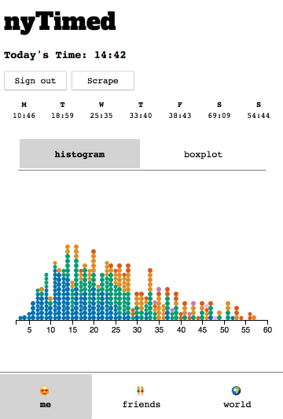
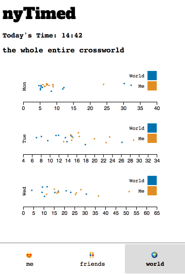

# nyTimed 

hello - you've found a chrome extension for sharing your nytimes crossword stats with friends (and the world!)

"you"          |  "friends"			| 	"world"
:-------------------------:|:-------------------------:|:---------------: |
  |   | 

## what the

there are three tabs to the extension

"you"

the you tab summarizes your crossword stats. the table at the top displays the average time you took to complete different days of crosswords. the plots below include a histogram of all crossword times (colored by day) and a boxplot that communicates the same information.

"friends"

the friends tab lists your friends' scores for today's crossword (or the crossword you're viewing at the moment). you'll be able to see your friends' scores once you complete a crossword. you can also see if they used checks 😈

"world"

this shows three scatter plots, showing the distribution of times for each day of the crossword. in gold are your last 10 (or fewer) times for that day and in blue are the rest of the extension users' times! clicking on the colors in the legend brings the clicked group into focus.

## to add friends
you can add friends but going to the friends tab, entering their gmail username in the text field, and hitting submit. text should appear below the box to tell you whether your friend addition was successful. there are a few reasons for failure:
* you're entering their full email! drop the '@gmail.com' and try again
* they're not on the extension yet and you should urge them to join
* there is a bug (likely) and we'd love to hear about it ! email us at nytimed.app@gmail.com

## to scrape old scores
click the 'scrape' button in the you tab. because of the way chrome extensions work, you can't close the tab or outside of the pop-up during the scrape. what you can do is move the tab to a separate desktop and let it run - it takes around 20 minutes to scrape one year of crosswords. 

exiting the process won't hurt you - starting the scrape back up later will skip over crosswords you've already gotten times for.

# faq
does this work with mobile?
not real-time :( if you navigate to desktop and rescrape, it'll grab all your scores

seeing weird times recored - either super small or large?
this is a bug we've found with the nyt crossword webapp but hopefully we'll resolve it soon

i don't have any friends?
add divyashan and advaithanand10 ! we're friendly 

this does not work - who should i tell?
email us at nytimed.app@gmail.com 🙃

